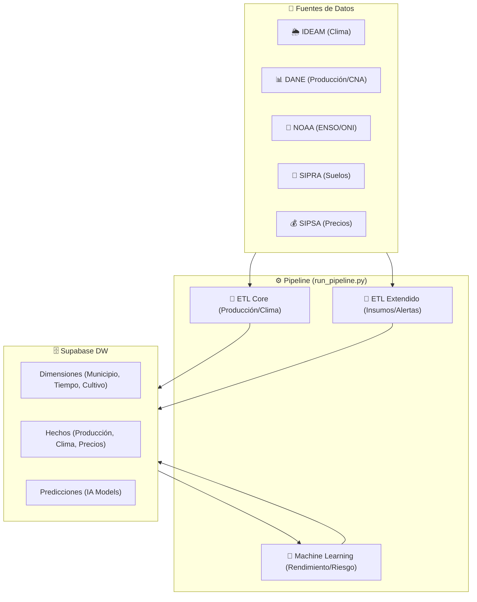

# 🌿 AgroIA Colombia: Inteligencia Agrícola 2026


**AgroIA Colombia** (AgroH) es un ecosistema avanzado de ingeniería de datos y aprendizaje automático diseñado para la resiliencia climática y productividad del agro colombiano. El sistema integra datos de múltiples entidades estatales para predecir rendimientos y generar alertas tempranas.

---

## 🏗️ Arquitectura de Datos

El sistema implementa un **Modelo Estrella (Star Schema)** optimizado para análisis y visualización en Power BI, alojado en Supabase (PostgreSQL).



---

## 🚀 Componentes Principales

### 🔄 Orquestador Profesional
Gestionado por `run_pipeline.py`, soporta tres modos de operación:
1.  **ETL Core**: Geografía (DIVIPOLA), Producción histórica y Series meteorológicas IDEAM V4.
2.  **ETL Extendido**: Integración con NOAA para Fenómeno de El Niño, Precios de Insumos (IPIA), Precios Mayoristas (SIPSA) y Aptitud de Suelos (SIPRA).
3.  **Machine Learning**: Feature Store automatizado y entrenamiento de modelos.

### 🧠 Inteligencia Artificial
*   **Modelo de Rendimiento**: Regresión (XGBoost) para estimar `rendimiento_t_ha` cruzando historial agrícola con variables climáticas acumuladas.
*   **Modelo de Alerta**: Clasificador de riesgo (Bajo/Medio/Alto) basado en anomalías climáticas y proyecciones ENSO.
*   **Feature Store**: Módulo `build_features.py` que consolida variables latentes para entrenamiento continuo.

### 📊 Capa de Visualización (Power BI Ready)
El esquema incluye vistas SQL pre-calculadas para consumo inmediato:
*   `v_dashboard_agro`: Visión 360° de producción vs clima.
*   `v_monitor_climatico`: Seguimiento mensual con fase ENSO (Niño/Niña).
*   `v_predicciones_modelo`: Comparativa de rendimiento real vs predicho.
*   `v_alertas_climaticas`: Monitor de riesgos activos por municipio.

---

## 🛠️ Instalación y Configuración

### 1. Requisitos Previos
*   Python 3.9+
*   PostgreSQL (Supabase recomendado)

### 2. Configuración del Entorno
```powershell
# Instalación de dependencias
pip install -r requirements.txt

# Configuración de variables (.env)
SUPABASE_DB_HOST=tu_host
SUPABASE_DB_USER=postgres
SUPABASE_DB_PASS=tu_password
PIPELINE_YEAR_END=2026
```

---

## 📖 Modo de Uso

El sistema es interactivo y proporciona feedback visual mediante la librería `Rich`.

*   **Ejecución Completa**:
    ```bash
    python run_pipeline.py --mode all --once
    ```
*   **Ejecución Modular**:
    ```bash
    python run_pipeline.py --mode models --once   # Solo entrenamiento IA
    python run_pipeline.py --mode core --once     # Solo datos base
    ```
*   **Modo Servidor (Scheduler)**:
    ```bash
    python run_pipeline.py --mode all
    ```
    *Activa el programador para actualizaciones automáticas todos los lunes a las 02:00 AM.*

---

## 📂 Estructura del Proyecto

*   `clean/`: Algoritmos de normalización y limpieza espacial.
*   `extract/`: Conectores API (Socrata, NOAA, Web Scraping).
*   `load/`: Gestión de DB (Upsert batch, Star Schema DDL).
*   `models/`: Lógica de entrenamiento y Feature Engineering.
*   `validate/`: Sistema de auditoría de calidad de datos.

---

## 📡 Fuentes de Datos Oficiales
*   [Datos Abiertos Colombia](https://www.datos.gov.co/): Producción Agrícola (EVA), Estaciones IDEAM.
*   [NOAA Climate Prediction Center](https://www.cpc.ncep.noaa.gov/): Oceanic Niño Index (ONI).
*   [SIPSA/DANE](https://www.dane.gov.co/): Precios y Censo Nacional Agropecuario.

---
© 2026 AgroIA Team | Innovación para el campo colombiano.
